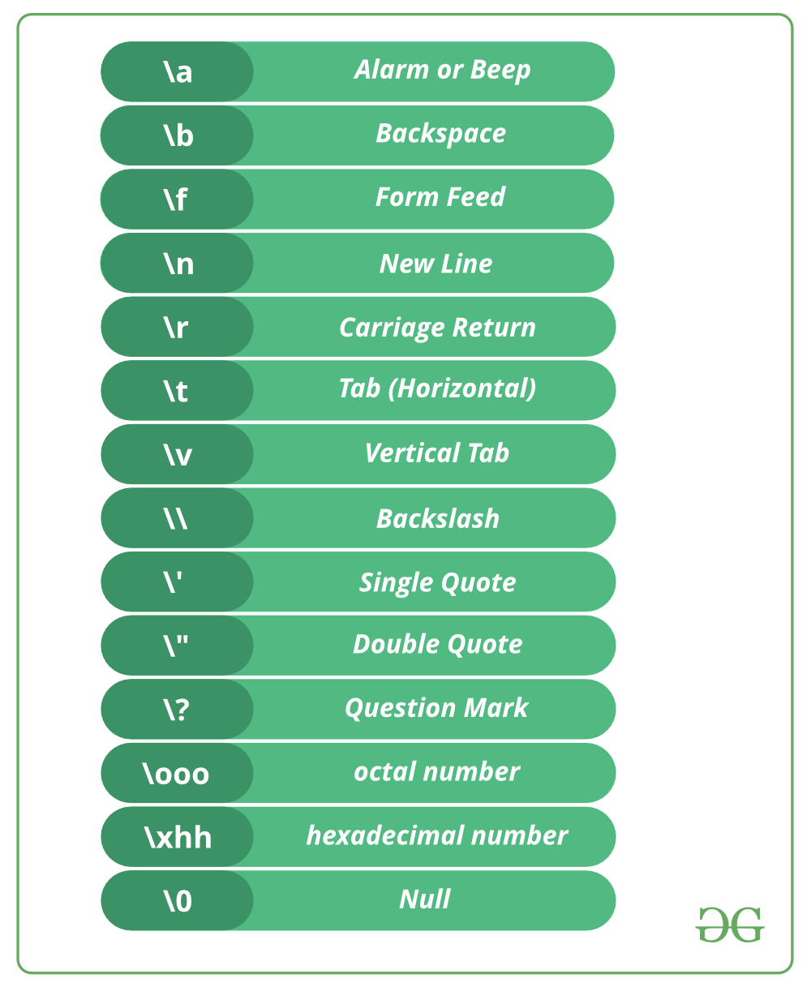

# Structure of a Code
*************************************************************
## Task instructions:
For this task, you must write a simple code that prints the text:

> I love coding in C.
>
> This is my first task.

With the line separation.

Use this checklist to guide yourself:
- [ ] Write the needed [libraries](#libraries)
- [ ] Write the main function
- [ ] Write the [printf function](#Basic-Functions) that you will use
  - Remember to include the required [escape sequence](#escape-sequences) to separate
    in lines.
- [ ] Test the program using the `Check` button below

Use the description below to understand better how to correctly write
the code.
*************************************************************
<h2 id = "libraries">[What are Libraries?](https://www.programiz.com/c-programming/library-function)</h2>

***Libraries*** are a compilation of functions
that are already programmed to execute certain
actions, you can freely use them and check their
documentation online.

To use a certain library inside your code, you
must type **At the Beginning of your Code**
the statement:

    #include<NAMEOFTHELIBRARY>

For example:

Usually the functions `printf()` and `scanf()`
are found inside the library `stdio.h` which is why
almost always we begin every code with the statement

    #include<stdio.h>
*************************************************************
<h3 id = "Basic-Functions">Usage of Basic Functions [`printf()`](http://www.it.uc3m.es/pbasanta/asng/course_notes/input_output_printf_es.html) and [`scanf()`](https://www.it.uc3m.es/pbasanta/asng/course_notes/input_output_function_scanf_es.html)</h3>

The function `printf()` allows you to show in console some text.
The way to use it is as follows:

    printf("Text to be displayed");

<h4 id = "escape-sequences">Escape Sequences</h4>
This syntax is used for different scenarios, depending on where you
write them you can change the style of the printed text.

#### Format Specifiers
To display the value of any variable, you must use the correct
format specifier, check the table below for reference.

|       Data Type       | Format Specifier | Example                                                                 |
|:---------------------:|:----------------:|-------------------------------------------------------------------------|
|          int          |        %d        | `printf("This prints the int %d", variable);`                           |
|         char          |        %c        | `printf("This prints the char %c", variable);`                          |
|         float         |        %f        | `printf("This prints the float %f", variable);`                         |
| float with n decimals |       %.nf       | `printf("This prints the float with 2 decimal points %.2f", variable);` |
|        string         |        %s        | `printf("This prints the string %s", variable);`                        |

This is an example to print a whole text with two different variables:

    printf("Value of variable 1 of \"integer\" type: %d\nValue of variable 2 of \"character\" type: %c", intVariable, charVariable);

If `intVariable = 156` and `charVariable = 'a'`

this prints out &rarr;

>Value of variable 1 of "integer" type: 156
>
> Value of variable 2 of "character" type: a

*************************************************************
## How does a program run?

The code you write is first compiled, this means:

- The computer reads line by line everything in your code, following
  the instructions you gave it.
- It detects the libraries you declared at the beginning of your
  program and checks the available functions from each library.
- It reads [*global variables and/or functions*](course://lesson2/task1/task.md)
  their declaration and their definition.
- Then it enters the `main()` function, where the statements to be
  executed are found.
- If inside the `main()` function, another function is called,
  the program will skip to this second function definition and read the
  statements inside, when it reaches a `return`, it will **return**
  to where it left off in the `main()` function.

[//]: # ()
[//]: # (This is a task description file.)

[//]: # (Its content will be displayed to a learner)

[//]: # (in the **Task Description** window.)

[//]: # ()
[//]: # (It supports both Markdown and HTML.)

[//]: # (To toggle the format, you can rename **task.md**)

[//]: # (to **task.html**, or vice versa.)

[//]: # (The default task description format can be changed)

[//]: # (in **Preferences | Tools | Education**,)

[//]: # (but this will not affect any existing task description files.)

[//]: # ()
[//]: # (The following features are available in)

[//]: # (**task.md/task.html** which are specific to the EduTools plugin:)

[//]: # ()
[//]: # (- Hints can be added anywhere in the task text.)

[//]: # (Type "hint" and press Tab.)

[//]: # (Hints should be added to an empty line in the task text.)

[//]: # (In hints you can use both HTML and Markdown.)

[//]: # (
)

[//]: # ()
[//]: # (Text of your hint)

[//]: # ()
[//]: # (
)

[//]: # ()
[//]: # (- You may need to refer your learners to a particular lesson,)

[//]: # (task, or file. To achieve this, you can use the in-course links.)

[//]: # (Specify the path using the `[link_text]&#40;course://lesson1/task1/file1&#41;` format.)

[//]: # ()
[//]: # (- You can insert shortcuts in the task description.)

[//]: # (While **task.html/task.md** is open, right-click anywhere)

[//]: # (on the **Editor** tab and choose the **Insert shortcut** option)

[//]: # (from the context menu.)

[//]: # (For example: &shortcut:FileStructurePopup;.)

[//]: # ()
[//]: # (- Insert the &percnt;`IDE_NAME`&percnt; macro,)

[//]: # (which will be replaced by the actual IDE name.)

[//]: # (For example, **%IDE_NAME%**.)

[//]: # ()
[//]: # (- Insert PSI elements, by using links like)

[//]: # (`[element_description]&#40;psi_element://link.to.element&#41;`.)

[//]: # (To get such a link, right-click the class or method)

[//]: # (and select **Copy Reference**.)

[//]: # (Then press &shortcut:EditorPaste; to insert the link where appropriate.)

[//]: # (For example, a [link to the "contains" method]&#40;psi_element://java.lang.String#contains&#41;.)

[//]: # ()
[//]: # (- You can add link to file using **full path** like this:)

[//]: # (  `[file_link]&#40;file://lesson1/task1/file.txt&#41;`.)